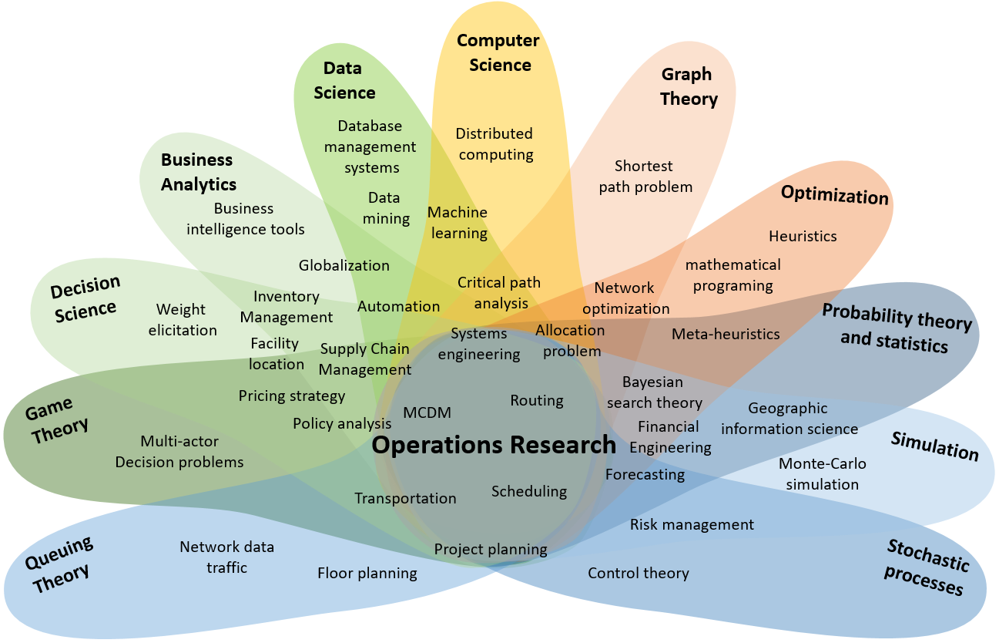

# Awesome Operations Research

> A map-aligned guide to Operations Research topics, methods, software, and learning resources.

Operations Research (OR) uses mathematical modeling, optimization, simulation, probability, algorithms, and analytics to support better decisions in complex systems. This repository organizes the field into a practical reference for students, researchers, practitioners, and self-learners.

Image credit: [Alex Elkjær Vasegaard](https://towardsdatascience.com/why-operations-research-is-awesome-an-introduction-7a0b9e62b405/).

## Table of Contents

- [How to Use This List](#how-to-use-this-list)
- [What is Operations Research?](#what-is-operations-research)
- [Why Operations Research is Important](#why-operations-research-is-important)
- [Core Areas of Operations Research](#core-areas-of-operations-research)
- [Detailed Topic Areas](#detailed-topic-areas)
- [Mathematical Optimization](#mathematical-optimization)
- [Forecasting for OR](#forecasting-for-or)
- [Spreadsheet and Algebraic Modeling](#spreadsheet-and-algebraic-modeling)
- [Linear Programming](#linear-programming)
- [Integer and Mixed-Integer Programming](#integer-and-mixed-integer-programming)
- [Goal Programming](#goal-programming)
- [Postoptimal and Parametric Analysis](#postoptimal-and-parametric-analysis)
- [Nonlinear Optimization](#nonlinear-optimization)
- [Convex Optimization](#convex-optimization)
- [Dynamic Programming](#dynamic-programming)
- [Stochastic Processes](#stochastic-processes)
- [Markov Chains](#markov-chains)
- [Queueing Theory](#queueing-theory)
- [Simulation](#simulation)
- [Decision Analysis](#decision-analysis)
- [Game Theory](#game-theory)
- [Network Optimization](#network-optimization)
- [Traveling Salesperson Problem](#traveling-salesperson-problem)
- [Scheduling](#scheduling)
- [Inventory Theory](#inventory-theory)
- [Transportation and Logistics](#transportation-and-logistics)
- [Supply Chain Optimization](#supply-chain-optimization)
- [Revenue Management](#revenue-management)
- [Analytics, Data Science, and Machine Learning Connections](#analytics-data-science-and-machine-learning-connections)
- [Applications of Operations Research in Industry](#applications-of-operations-research-in-industry)
- [Learning Roadmaps](#learning-roadmaps)
- [Supply Chain and Logistics Path](#supply-chain-and-logistics-path)
- [Healthcare, Energy, and Public Systems Path](#healthcare-energy-and-public-systems-path)
- [Modern Decision Systems Path](#modern-decision-systems-path)
- [Recommended Books](#recommended-books)
- [Courses and Lecture Notes](#courses-and-lecture-notes)
- [Software Tools and Solvers](#software-tools-and-solvers)
- [Python Libraries](#python-libraries)
- [Julia Libraries](#julia-libraries)
- [R Libraries](#r-libraries)
- [Modeling Languages](#modeling-languages)
- [Commercial Solvers](#commercial-solvers)
- [Open-Source Solvers](#open-source-solvers)
- [Datasets and Benchmark Problems](#datasets-and-benchmark-problems)
- [Journals and Conferences](#journals-and-conferences)
- [Professional Societies and Communities](#professional-societies-and-communities)
- [Blogs, Newsletters, and Online Resources](#blogs-newsletters-and-online-resources)
- [Research Groups and University Programs](#research-groups-and-university-programs)
- [Career Paths in Operations Research](#career-paths-in-operations-research)
- [How to Contribute](#how-to-contribute)
- [License](#license)

## How to Use This List

- Use **Core Areas** to understand the main branches of OR and how they fit together.
- Use **Learning Roadmaps** to choose a sequence of topics based on your background.
- Use **Software Tools and Solvers** when you are ready to model and solve real problems.
- Use **Applications** to connect OR methods to industry problems.
- Use **Books, Courses, and Notes** for deeper study and teaching material.
- Use **Datasets and Benchmarks** to practice on standard problem families.

## What is Operations Research?

Operations Research is the discipline of building analytical models to improve decisions. An OR project usually starts with a messy real-world system and turns it into a model with:

- **Decision variables**: the choices available, such as routes, schedules, prices, assignments, inventory levels, or production quantities.
- **Objectives**: what should be maximized or minimized, such as profit, service level, throughput, reliability, fairness, travel time, cost, risk, or emissions.
- **Constraints**: the rules and limits, such as capacity, budget, labor availability, timing, physics, demand, policy, or safety.
- **Uncertainty**: unknown demand, travel times, failures, arrivals, prices, weather, human behavior, or measurement error.
- **Algorithms and computation**: methods that find exact, approximate, robust, or explainable decisions.

OR is interdisciplinary by design. It draws from applied mathematics, statistics, computer science, economics, industrial engineering, data science, and domain knowledge. Its practical focus is not only "what will happen?" but also "what should we do?"

## Why Operations Research is Important

- **It turns complexity into decisions**: OR provides a language for choosing among many feasible actions when intuition alone is unreliable.
- **It handles tradeoffs explicitly**: cost, speed, risk, service quality, equity, utilization, and resilience can be modeled rather than argued informally.
- **It scales scarce resources**: OR helps allocate people, vehicles, machines, capital, energy, hospital beds, classrooms, warehouses, and computing resources.
- **It supports automation with accountability**: optimization models expose assumptions, constraints, and objective functions for review.
- **It complements data science**: predictive models estimate demand, risk, or travel time; OR uses those estimates to prescribe actions.
- **It improves public and private systems**: logistics, healthcare, energy, finance, manufacturing, defense, sports, telecommunications, and government all use OR methods.

## Core Areas of Operations Research

- **Optimization**: choose the best feasible solution under constraints.
- **Stochastic modeling**: represent uncertainty with probability, random processes, and scenarios.
- **Simulation**: test systems and policies when closed-form analysis is difficult.
- **Decision analysis**: structure choices under uncertainty, risk, and multiple criteria.
- **Game theory**: model strategic interaction among decision-makers.
- **Networks and graphs**: optimize flows, paths, connectivity, routing, and matching.
- **Scheduling and sequencing**: allocate work over time on machines, people, rooms, or vehicles.
- **Inventory and supply chains**: manage stock, production, distribution, and service levels.
- **Revenue management**: choose prices, availability, and capacity controls under demand uncertainty.
- **Analytics and machine learning integration**: combine prediction, optimization, experimentation, and decision systems.

## Detailed Topic Areas

Beyond the core areas above, OR includes a wider set of modeling foundations, methods, applications, and practice topics:

- **Modeling foundations**: modeling decisions; objectives, constraints, and uncertainty; spreadsheet and algebraic modeling; forecasting for OR; probability and statistics for OR; model validation and sensitivity; multi-objective optimization; data envelopment analysis.
- **Advanced optimization**: goal programming; postoptimal and parametric analysis; conic and semidefinite optimization; stochastic programming; robust optimization; decomposition methods; constraint programming; heuristics and metaheuristics; global optimization and MINLP; combinatorial optimization; least squares, quadratic programming, and piecewise-linear models; polyhedral theory and cutting planes; complementarity and equilibrium models.
- **Stochastic systems**: Markov chains; Markov decision processes; reliability and maintenance; risk analysis; simulation optimization.
- **Networks and systems**: matching and assignment; traveling salesperson problem; vehicle routing; facility location; project management, PERT, and CPM; optimal control; system dynamics and feedback models.
- **Applications**: production planning and manufacturing; service operations and staffing; healthcare OR; energy and power systems; finance, portfolio, and risk; public-sector and policy OR; telecom, cloud, and computing systems; sports and entertainment scheduling; agriculture and natural resources.
- **Modern practice**: prescriptive analytics; data-driven optimization; digital twins and what-if systems; solver engineering and deployment; responsible OR and decision governance; OR communication and change; behavioral OR and human decisions.

## Mathematical Optimization

Mathematical optimization is the central modeling language of OR. It represents decisions as variables, limitations as constraints, and goals as objective functions.

- **Optimization model**: a mathematical representation of a decision problem.
- **Feasible region**: all solutions that satisfy the constraints.
- **Objective function**: the quantity to minimize or maximize.
- **Duality**: a complementary view of an optimization problem that often gives bounds, prices, and sensitivity information.
- **Sensitivity analysis**: study how solutions change when costs, capacities, or demand assumptions change.
- **Decomposition**: split large models into smaller subproblems using structure such as time, geography, scenarios, or networks.
- **Heuristics and metaheuristics**: find good solutions when exact methods are too slow or unnecessary.
- **Robust optimization**: choose decisions that remain effective across uncertain parameter ranges.
- **Stochastic optimization**: optimize decisions with explicitly modeled uncertainty.

## Forecasting for OR

Forecasting turns historical data, explanatory variables, and domain judgment into inputs for OR models. Textbooks often connect forecasting to inventory, staffing, capacity planning, simulation, and revenue management because predictive errors directly affect prescriptive decisions.

- **Time series models**: capture trend, seasonality, cycles, and autocorrelation.
- **Causal and explanatory models**: relate demand, arrivals, prices, or failures to drivers such as promotions, weather, policy, or calendar effects.
- **Forecast error**: feeds safety stock, staffing buffers, service levels, and scenario design.
- **Scenario generation**: converts uncertain forecasts into inputs for stochastic programming, robust optimization, and simulation.
- **Decision-focused evaluation**: judges forecasts by downstream policy quality, not only statistical accuracy.

Useful resources:

- [Forecasting: Principles and Practice](https://otexts.com/fpp3/) by Rob J. Hyndman and George Athanasopoulos
- [MIT 15.071 The Analytics Edge](https://ocw.mit.edu/courses/15-071-the-analytics-edge-spring-2017/)
- [R forecast package](https://pkg.robjhyndman.com/forecast/)

## Spreadsheet and Algebraic Modeling

Many OR textbooks teach spreadsheet models and algebraic formulations side by side. Spreadsheets are useful for transparent prototypes and stakeholder review; algebraic modeling languages are better for indexed models, reproducibility, automation, and deployment.

- **Spreadsheet models**: organize inputs, decisions, formulas, constraints, and outputs in an auditable layout.
- **Algebraic notation**: defines sets, indices, parameters, variables, constraints, and objectives.
- **Solver add-ins**: connect spreadsheet formulas to LP, nonlinear, and integer solvers.
- **Model auditing**: checks units, formulas, hidden constants, feasibility, and data assumptions.
- **Migration path**: move from spreadsheet prototype to Pyomo, JuMP, AMPL, GAMS, MiniZinc, or production APIs when scale and maintainability matter.

Useful resources:

- [OpenSolver](https://opensolver.org/)
- [Pyomo](https://www.pyomo.org/)
- [JuMP](https://jump.dev/JuMP.jl/stable/)

## Linear Programming

Linear programming (LP) optimizes a linear objective subject to linear constraints. LP is often the first serious OR tool because it is expressive, computationally mature, and useful across many industries.

- **Simplex method**: moves among vertices of the feasible polyhedron and remains important in practice.
- **Interior-point methods**: solve large LPs by moving through the interior of the feasible region.
- **Dual variables and shadow prices**: estimate the marginal value of relaxing a constraint.
- **Reduced costs**: identify whether a nonbasic variable is attractive to include in a solution.
- **Sensitivity ranges**: show when an optimal basis remains valid as coefficients change.
- **Common applications**: blending, production planning, staff allocation, diet problems, portfolio allocation, transportation, and network flows.

Useful resources:

- [Linear Programming FAQ](https://neos-guide.org/guide/types/linear-programming/)
- [MIT 15.053 Optimization Methods in Management Science](https://ocw.mit.edu/courses/15-053-optimization-methods-in-management-science-spring-2013/)
- [Introduction to Linear Optimization](https://www.athenasc.com/linoptbook.html) by Dimitris Bertsimas and John N. Tsitsiklis

## Integer and Mixed-Integer Programming

Integer programming (IP) and mixed-integer programming (MIP or MILP) add discrete choices to optimization models. They are essential when decisions involve yes/no choices, counts, assignments, fixed charges, or logical rules.

- **Binary variables**: model on/off, assign/not assign, open/close, select/reject, or precedence decisions.
- **Integer variables**: model counts such as number of trucks, workers, machines, batches, or units.
- **Branch and bound**: systematically explores decision trees while using bounds to prune subproblems.
- **Branch and cut**: strengthens formulations with valid inequalities and cutting planes.
- **Branch and price**: combines branching with column generation for huge variable sets.
- **Formulation quality**: strong formulations solve faster because their continuous relaxations are tighter.
- **Common applications**: facility location, vehicle routing, unit commitment, capital budgeting, crew scheduling, assignment, production planning, and lot sizing.

Useful resources:

- [Integer Programming](https://optimization.cbe.cornell.edu/index.php?title=Integer_programming) from the Cornell Optimization Wiki
- [SCIP Book](https://scipbook.readthedocs.io/)
- [MIPLIB](https://miplib.zib.de/)

## Goal Programming

Goal programming extends linear programming for decisions with several aspiration levels. Instead of optimizing one natural objective, it introduces deviation variables and minimizes unwanted shortfalls or excesses from targets.

- **Aspiration levels**: target values for cost, service, risk, staffing, output, equity, or other goals.
- **Deviation variables**: measure underachievement or overachievement relative to each target.
- **Weighted goal programming**: combines deviations in a single weighted objective.
- **Preemptive goal programming**: satisfies higher-priority goals before lower-priority goals.
- **Soft constraints**: allow controlled violations with penalties rather than declaring the model infeasible.

Useful resources:

- [NEOS Guide: Multiobjective Optimization](https://neos-guide.org/guide/types/multiobjective/)
- [MIT 15.053 Optimization Methods in Management Science](https://ocw.mit.edu/courses/15-053-optimization-methods-in-management-science-spring-2013/)

## Postoptimal and Parametric Analysis

Postoptimal and parametric analysis studies what happens after an optimization model has been solved. It is central to textbook LP because managers usually ask how stable a recommendation is and which resources, costs, or requirements matter most.

- **Sensitivity ranges**: show where current solution interpretations remain valid.
- **Shadow prices**: estimate marginal value for binding resources within valid ranges.
- **Reduced costs**: explain when inactive activities become attractive.
- **Parametric right-hand-side analysis**: studies changing capacities, demands, or requirements.
- **Parametric objective analysis**: studies changing costs, revenues, or priorities.
- **Reoptimization**: uses previous solutions when model data changes.

Useful resources:

- [Linear Programming FAQ](https://neos-guide.org/guide/types/linear-programming/)
- [MIT 15.053 Optimization Methods in Management Science](https://ocw.mit.edu/courses/15-053-optimization-methods-in-management-science-spring-2013/)

## Nonlinear Optimization

Nonlinear optimization handles objective functions or constraints that are not linear. It appears in engineering design, energy systems, pricing, finance, machine learning, control, and scientific computing.

- **Unconstrained optimization**: minimize or maximize a nonlinear function without explicit constraints.
- **Constrained nonlinear programming**: handle equality, inequality, and bound constraints.
- **Gradient methods**: use first derivatives to find improving directions.
- **Newton and quasi-Newton methods**: use curvature information for faster local convergence.
- **Sequential quadratic programming**: solve a sequence of quadratic approximations.
- **Interior-point nonlinear programming**: extend barrier methods to nonlinear constraints.
- **Global optimization**: search for globally optimal solutions when nonconvexity creates many local optima.
- **Derivative-free optimization**: solve problems where derivatives are unavailable, noisy, or expensive.

Useful resources:

- [NEOS Guide: Nonlinear Programming](https://neos-guide.org/guide/types/nonlinear-programming/)
- [Numerical Optimization](https://link.springer.com/book/10.1007/978-0-387-40065-5) by Jorge Nocedal and Stephen J. Wright
- [NLopt](https://nlopt.readthedocs.io/)

## Convex Optimization

Convex optimization studies problems where local optima are global optima. This structure makes many models theoretically clean and computationally reliable.

- **Convex sets and functions**: the geometric foundation of tractable optimization.
- **KKT conditions**: optimality conditions for constrained optimization.
- **Conic optimization**: includes linear, second-order cone, and semidefinite programming.
- **Lagrangian duality**: produces bounds, certificates, and economic interpretations.
- **Proximal methods**: useful for large-scale, nonsmooth, and composite objectives.
- **Disciplined convex programming**: a modeling approach that verifies convexity from known rules.
- **Common applications**: portfolio optimization, signal processing, machine learning, control, energy dispatch, robust optimization, and statistical estimation.

Useful resources:

- [Convex Optimization](https://web.stanford.edu/~boyd/cvxbook/) by Stephen Boyd and Lieven Vandenberghe
- [Stanford EE364A Convex Optimization](https://web.stanford.edu/class/ee364a/)
- [CVXPY Short Course](https://www.cvxgrp.org/cvx_short_course/)

## Dynamic Programming

Dynamic programming (DP) solves sequential decision problems by decomposing them into stages and states. It is central to inventory control, routing, Markov decision processes, reinforcement learning, and optimal control.

- **State**: the information needed to make a decision at a stage.
- **Bellman equation**: expresses optimal value recursively.
- **Principle of optimality**: an optimal policy contains optimal sub-decisions.
- **Finite-horizon DP**: solve decisions over a fixed number of stages.
- **Infinite-horizon DP**: solve recurring decisions with discounted or average costs.
- **Approximate dynamic programming**: use approximations when exact state spaces are too large.
- **Common applications**: shortest paths, equipment replacement, inventory replenishment, revenue management, resource allocation, and reinforcement learning.

Useful resources:

- [Dynamic Programming and Optimal Control](https://www.athenasc.com/dpbook.html) by Dimitri P. Bertsekas
- [MIT 6.231 Dynamic Programming and Stochastic Control](https://ocw.mit.edu/courses/6-231-dynamic-programming-and-stochastic-control-fall-2015/)
- [Algorithms for Decision Making](https://algorithmsbook.com/) by Mykel J. Kochenderfer, Tim A. Wheeler, and Kyle H. Wray

## Stochastic Processes

Stochastic processes model systems that evolve randomly over time. They give OR a foundation for uncertainty, arrivals, failures, demand, reliability, queues, and risk.

- **Random variables and distributions**: model uncertain quantities.
- **Poisson processes**: model random arrivals in time or space.
- **Renewal processes**: model repeated events with random interarrival times.
- **Markov chains**: model systems where the next state depends on the current state.
- **Markov decision processes**: combine Markov dynamics with controllable actions.
- **Brownian motion and diffusion models**: approximate noisy continuous-time systems.
- **Reliability models**: represent failure, repair, maintenance, and survival.
- **Common applications**: call centers, web services, inventory, finance, maintenance, public safety, and healthcare operations.

Useful resources:

- [Introduction to Probability Models](https://www.elsevier.com/books/introduction-to-probability-models/ross/978-0-12-814346-9) by Sheldon M. Ross
- [MIT 6.262 Discrete Stochastic Processes](https://ocw.mit.edu/courses/6-262-discrete-stochastic-processes-spring-2011/)
- [ProbabilityCourse.com](https://www.probabilitycourse.com/)

## Markov Chains

Markov chains model random movement among states when the next state depends on the current state. They are a classical OR textbook topic and provide the foundation for reliability models, queues, inventory models, and Markov decision processes.

- **Transition matrix**: probabilities of moving from each state to each next state.
- **State classification**: recurrent, transient, absorbing, periodic, and communicating states.
- **Steady-state probabilities**: long-run state occupancy when a limiting distribution is meaningful.
- **Absorbing chains**: model endpoints such as failure, churn, completion, or default.
- **First-passage analysis**: estimates time or probability of reaching a target state.

Useful resources:

- [MIT 6.262 Discrete Stochastic Processes](https://ocw.mit.edu/courses/6-262-discrete-stochastic-processes-spring-2011/)
- [ProbabilityCourse.com: Markov Chains](https://www.probabilitycourse.com/chapter11/11_2_1_introduction.php)

## Queueing Theory

Queueing theory studies waiting lines and service systems. It helps estimate waiting time, congestion, utilization, abandonment, and capacity needs.

- **Arrival process**: how customers, jobs, patients, packets, or calls enter the system.
- **Service process**: how long work takes and how many servers are available.
- **Traffic intensity**: a measure of load relative to capacity.
- **Little's Law**: relates average number in system, arrival rate, and time in system.
- **M/M/1 and M/M/c queues**: basic models with Poisson arrivals and exponential service times.
- **Priority queues**: represent triage, premium service, deadlines, or emergency handling.
- **Queueing networks**: model connected service stations.
- **Common applications**: hospitals, call centers, cloud computing, manufacturing, airports, restaurants, telecommunications, and public services.

Useful resources:

- [Queueing Theory Calculator](https://www.supositorio.com/rcalc/rcalclite.htm)
- [Queueing Theory](https://people.revoledu.com/kardi/tutorial/Queuing/) tutorial by Kardi Teknomo
- [Fundamentals of Queueing Theory](https://www.wiley.com/en-us/Fundamentals+of+Queueing+Theory%2C+5th+Edition-p-9781118943526) by Gross, Shortle, Thompson, and Harris

## Simulation

Simulation evaluates systems by imitating their behavior. It is useful when uncertainty, interactions, nonlinearity, or operational details make analytical models too simplified.

- **Monte Carlo simulation**: estimate outcomes by repeated random sampling.
- **Discrete-event simulation**: model systems that change at event times such as arrivals, departures, failures, and repairs.
- **Agent-based simulation**: model individual actors and emergent behavior.
- **System dynamics**: model feedback loops and aggregate flows over time.
- **Variance reduction**: improve simulation efficiency with techniques such as common random numbers and antithetic variates.
- **Verification and validation**: check that the simulation is built correctly and represents the real system well enough.
- **Common applications**: warehouses, hospitals, ports, manufacturing lines, traffic systems, epidemics, military operations, and finance.

Useful resources:

- [AnyLogic Simulation Modeling](https://www.anylogic.com/resources/)
- [SimPy](https://simpy.readthedocs.io/)
- [Simulation Modeling and Analysis](https://www.mheducation.com/highered/product/simulation-modeling-analysis-law/M9781264268770.html) by Averill M. Law

## Decision Analysis

Decision analysis helps structure decisions when uncertainty, preferences, risk, and multiple objectives matter. It is especially useful when the "best" answer depends on values and tradeoffs.

- **Decision trees**: show sequential choices, uncertainties, and outcomes.
- **Expected value**: evaluate options using probability-weighted outcomes.
- **Utility theory**: model risk preferences beyond simple expected money.
- **Value of information**: estimate how much better decisions could be with additional data.
- **Multi-criteria decision analysis**: compare alternatives across multiple objectives.
- **Analytic hierarchy process**: structure pairwise comparisons and priorities.
- **Robust decision-making**: choose policies that perform acceptably across many plausible futures.

Useful resources:

- [Decision Analysis Society](https://connect.informs.org/decisionanalysis/home)
- [Society for Decision Making Under Deep Uncertainty](https://www.deepuncertainty.org/)
- [Making Hard Decisions with DecisionTools](https://www.cengage.com/c/making-hard-decisions-with-decisiontools-3e-clemen/9780538797573/) by Robert T. Clemen and Terence Reilly

## Game Theory

Game theory models strategic interactions among decision-makers. It is useful when outcomes depend not only on your decision but also on the choices of competitors, customers, markets, adversaries, or partners.

- **Normal-form games**: represent simultaneous strategic choices.
- **Extensive-form games**: represent sequential decisions and information sets.
- **Nash equilibrium**: a stable strategy profile where no player benefits from unilateral deviation.
- **Mixed strategies**: randomize actions when no pure strategy is stable.
- **Mechanism design**: design rules so self-interested behavior leads to desired outcomes.
- **Auctions and matching markets**: allocate resources when agents have private values or preferences.
- **Common applications**: pricing, auctions, energy markets, cybersecurity, traffic networks, bargaining, procurement, and platform design.

Useful resources:

- [Game Theory](https://www.coursera.org/learn/game-theory-1) by Stanford University and The University of British Columbia
- [Twenty Lectures on Algorithmic Game Theory](https://www.cambridge.org/core/books/twenty-lectures-on-algorithmic-game-theory/29292348F08298B4E1950885C984E8FB) by Tim Roughgarden
- [Mechanism Design: A Linear Programming Approach](https://theory.stanford.edu/~tim/f13/l/l9.pdf) notes by Tim Roughgarden

## Network Optimization

Network optimization uses graph structure to solve problems involving paths, flows, cuts, connectivity, and assignments.

- **Shortest path**: find minimum-cost paths through a graph.
- **Minimum spanning tree**: connect nodes at minimum total edge cost.
- **Maximum flow and minimum cut**: route flow through capacitated networks.
- **Minimum-cost flow**: choose flows with both capacity and cost.
- **Matching and assignment**: pair agents, tasks, jobs, or resources.
- **Vehicle routing**: plan routes for fleets with capacity, time windows, and service constraints.
- **Network design**: choose links, facilities, or capacities to build.
- **Common applications**: logistics, telecommunications, power grids, transit, water networks, sports scheduling, and data routing.

Useful resources:

- [Network Flows](https://www.pearson.com/en-us/subject-catalog/p/network-flows-theory-algorithms-and-applications/P200000003207/9780136175490) by Ahuja, Magnanti, and Orlin
- [Network Optimization](https://www.athenasc.com/netbook.html) by Dimitri P. Bertsekas
- [Google OR-Tools Routing](https://developers.google.com/optimization/routing)

## Traveling Salesperson Problem

The traveling salesperson problem (TSP) asks for a minimum-cost tour that visits each location once and returns to the start. It is one of the canonical examples in OR textbooks because it connects routing, integer programming, combinatorial optimization, cutting planes, heuristics, and benchmark-driven algorithm design.

- **Hamiltonian tours**: visit each node exactly once and return to the origin.
- **Subtour elimination**: prevents disconnected cycles from appearing in integer programming formulations.
- **Branch-and-cut**: combines enumeration with valid inequalities for exact solution.
- **Local search**: improves tours through 2-opt, 3-opt, swaps, and larger neighborhoods.
- **Approximation algorithms**: provide performance guarantees for structured variants such as metric TSP.
- **Extensions**: vehicle routing, time windows, pickup-delivery, multiple depots, and stochastic travel times.

Useful resources:

- [Concorde TSP Solver](https://www.math.uwaterloo.ca/tsp/concorde.html)
- [TSPLIB](http://comopt.ifi.uni-heidelberg.de/software/TSPLIB95/)
- [Google OR-Tools Routing](https://developers.google.com/optimization/routing)

## Scheduling

Scheduling allocates jobs, people, machines, rooms, vehicles, or tasks over time. It is one of the most common OR problem families in real operations.

- **Single-machine scheduling**: sequence jobs on one resource.
- **Parallel-machine scheduling**: assign and sequence jobs across similar resources.
- **Flow shop and job shop scheduling**: model manufacturing or service systems with ordered operations.
- **Project scheduling**: manage precedence relationships, critical paths, and resource limits.
- **Crew and workforce scheduling**: assign shifts under labor rules and demand coverage.
- **Timetabling**: allocate classes, exams, rooms, and instructors.
- **Common objectives**: minimize makespan, lateness, tardiness, overtime, idle time, or cost; maximize service level or fairness.

Useful resources:

- [Scheduling: Theory, Algorithms, and Systems](https://link.springer.com/book/10.1007/978-3-319-26580-3) by Michael L. Pinedo
- [Project Scheduling Problem Library](http://www.om-db.wi.tum.de/psplib/)
- [Google OR-Tools Scheduling](https://developers.google.com/optimization/scheduling)

## Inventory Theory

Inventory theory studies how much stock to keep, where to keep it, and when to replenish it. It balances service level, holding cost, ordering cost, shortage cost, perishability, and uncertainty.

- **Economic order quantity**: a basic tradeoff between ordering and holding cost.
- **Base-stock policies**: replenish up to a target inventory position.
- **Reorder point policies**: order when inventory falls below a threshold.
- **Safety stock**: buffer against demand and lead-time uncertainty.
- **Multi-echelon inventory**: coordinate stock across suppliers, warehouses, stores, and customers.
- **Perishable inventory**: model expiration, spoilage, or obsolescence.
- **Common applications**: retail, healthcare supplies, spare parts, e-commerce, manufacturing, food systems, and emergency response.

Useful resources:

- [Foundations of Inventory Management](https://www.mheducation.com/highered/product/foundations-inventory-management-zipkin/M9780256113790.html) by Paul H. Zipkin
- [Inventory Control](https://link.springer.com/book/10.1007/978-1-4419-6485-4) by Sven Axsater
- [MIT 15.762J Supply Chain Planning](https://ocw.mit.edu/courses/15-762j-supply-chain-planning-spring-2011/)

## Transportation and Logistics

Transportation and logistics focus on moving goods, people, vehicles, and information through networks reliably and efficiently.

- **Transportation problem**: ship quantities from origins to destinations at minimum cost.
- **Transshipment**: allow intermediate nodes such as hubs or warehouses.
- **Vehicle routing problem**: design routes for multiple vehicles.
- **Pickup and delivery**: route items or people with paired origins and destinations.
- **Time windows**: require service within specified time intervals.
- **Fleet sizing and assignment**: choose vehicles and assign them to demand.
- **Common applications**: parcel delivery, ride-hailing, public transit, trucking, maritime shipping, airline planning, emergency logistics, and humanitarian relief.

Useful resources:

- [Vehicle Routing Problem](http://vrp.galgos.inf.puc-rio.br/index.php/en/)
- [Transportation Research Part E](https://www.sciencedirect.com/journal/transportation-research-part-e-logistics-and-transportation-review)
- [DIMACS Vehicle Routing Challenge](http://dimacs.rutgers.edu/programs/challenge/vrp/)

## Supply Chain Optimization

Supply chain optimization coordinates sourcing, production, inventory, transportation, distribution, and service under uncertainty.

- **Network design**: choose suppliers, plants, warehouses, cross-docks, and fulfillment centers.
- **Demand planning**: forecast demand and translate forecasts into decisions.
- **Sales and operations planning**: balance demand, capacity, inventory, and finance over medium horizons.
- **Production planning**: allocate capacity, materials, and labor across time.
- **Distribution planning**: decide where and how to move products.
- **Resilience and risk**: plan for disruptions, supplier failures, demand shocks, and capacity shortages.
- **Sustainability**: include emissions, waste, energy, circularity, and service equity.

Useful resources:

- [MIT Center for Transportation and Logistics](https://ctl.mit.edu/)
- [Supply Chain Management: Strategy, Planning, and Operation](https://www.pearson.com/en-us/subject-catalog/p/supply-chain-management-strategy-planning-and-operation/P200000006437) by Sunil Chopra
- [The Supply Chain Management Research Center](https://scmresearch.org/)

## Revenue Management

Revenue management uses demand models, pricing, availability controls, and optimization to sell the right product to the right customer at the right time.

- **Price optimization**: choose prices based on demand, competition, margins, and capacity.
- **Capacity control**: protect capacity for higher-value demand.
- **Overbooking**: accept more reservations than capacity when no-shows are expected.
- **Assortment optimization**: choose which products to offer.
- **Choice modeling**: estimate how customers substitute among options.
- **Dynamic pricing**: update prices as demand, inventory, or time changes.
- **Common applications**: airlines, hotels, rental cars, e-commerce, retail, advertising, ticketing, freight, and cloud services.

Useful resources:

- [The Theory and Practice of Revenue Management](https://link.springer.com/book/10.1007/b139000) by Talluri and van Ryzin
- [Pricing and Revenue Optimization](https://www.sup.org/books/business/pricing-and-revenue-optimization) by Robert L. Phillips
- [Columbia Center for Pricing and Revenue Management](https://business.columbia.edu/pricing-revenue-management)

## Analytics, Data Science, and Machine Learning Connections

OR and data science are strongest together. Data science estimates what is happening or likely to happen; OR turns those estimates into decisions subject to constraints.

- **Predict-then-optimize**: use forecasts as inputs to optimization models.
- **Decision-focused learning**: train predictive models based on downstream decision quality.
- **Prescriptive analytics**: recommend actions rather than only describing or predicting outcomes.
- **Causal inference and experimentation**: estimate the effect of decisions or policies.
- **Reinforcement learning**: learn policies in sequential decision environments.
- **Bayesian optimization**: optimize expensive black-box functions.
- **MLOps for decisions**: monitor not only prediction error, but also operational impact, constraint violations, and decision drift.
- **Responsible decision systems**: evaluate fairness, robustness, explainability, privacy, and human oversight.

Useful resources:

- [PyData Global Optimization Tutorials](https://www.youtube.com/@PyDataTV/search?query=optimization)
- [Decision Optimization on IBM Developer](https://developer.ibm.com/decision-optimization/)
- [Cornell Optimization Wiki](https://optimization.cbe.cornell.edu/)

## Applications of Operations Research in Industry

- **Airlines and aviation**: crew pairing, fleet assignment, gate allocation, disruption recovery, pricing, overbooking, and maintenance scheduling.
- **Healthcare**: operating room scheduling, nurse rostering, ambulance location, patient flow, appointment systems, organ allocation, and medical inventory.
- **Manufacturing**: production planning, line balancing, maintenance, quality control, lot sizing, job shop scheduling, and capacity expansion.
- **Retail and e-commerce**: assortment, pricing, fulfillment, inventory placement, last-mile routing, personalization, and returns management.
- **Energy and utilities**: unit commitment, economic dispatch, storage operation, grid planning, renewable integration, and demand response.
- **Finance and insurance**: portfolio optimization, risk modeling, asset-liability management, fraud operations, claims staffing, and stress testing.
- **Telecommunications and cloud computing**: network design, bandwidth allocation, server placement, load balancing, reliability, and data center scheduling.
- **Transportation and mobility**: traffic signal timing, transit planning, ride matching, vehicle routing, fleet repositioning, and toll design.
- **Public sector and defense**: emergency response, resource allocation, disaster logistics, military planning, policy analysis, and border operations.
- **Sports and entertainment**: league scheduling, strategy analysis, ticket pricing, venue operations, and tournament design.
- **Agriculture and food systems**: crop planning, irrigation, cold chain logistics, harvest scheduling, and food bank distribution.
- **Education**: course timetabling, exam scheduling, admissions planning, classroom allocation, and student support resource allocation.

## Learning Roadmaps

### Beginner Path

1. Learn linear algebra, probability, calculus, and basic programming.
2. Study linear programming, duality, and sensitivity analysis.
3. Model small problems in Python, Julia, R, or a modeling language.
4. Learn integer programming and formulation patterns.
5. Practice with scheduling, transportation, inventory, and routing examples.
6. Read case studies to connect models to real operations.

### Optimization Practitioner Path

1. Linear programming and mixed-integer programming.
2. Convex optimization and nonlinear programming.
3. Decomposition, column generation, Benders decomposition, and Lagrangian relaxation.
4. Solver behavior, formulation strength, scaling, numerics, and debugging.
5. Production deployment: data pipelines, APIs, monitoring, explainability, and fallback policies.
6. Domain specialization in logistics, energy, workforce, pricing, or supply chain.

### Stochastic Systems Path

1. Probability, random variables, and stochastic processes.
2. Markov chains, Poisson processes, and renewal processes.
3. Queueing theory and service systems.
4. Simulation, Monte Carlo, and discrete-event modeling.
5. Stochastic dynamic programming and Markov decision processes.
6. Robust and stochastic optimization under uncertainty.

### Analytics and Machine Learning Path

1. Statistics, regression, forecasting, and causal inference.
2. Predictive modeling for demand, risk, duration, arrival rates, and customer choice.
3. Optimization models that consume predictions.
4. Decision-focused learning, reinforcement learning, and bandits.
5. Experimentation and impact measurement.
6. Governance for automated decision systems.

### Research Path

1. Real analysis, linear algebra, probability, and algorithms.
2. Convex analysis, mathematical programming, and complexity.
3. Integer programming, stochastic programming, dynamic programming, and approximation algorithms.
4. Read papers from INFORMS, MOS, IPCO, SODA, and applied domain journals.
5. Reproduce computational experiments on benchmark instances.
6. Develop new theory, algorithms, models, or domain-specific decision systems.

### Supply Chain and Logistics Path

1. Inventory theory: EOQ, newsvendor, reorder policies, safety stock, and multi-echelon inventory.
2. Transportation and assignment models.
3. Network flows, routing, and facility location.
4. Vehicle routing with capacity, time windows, pickup-delivery, and last-mile constraints.
5. Scheduling for production, crews, warehouses, and transportation assets.
6. Supply chain optimization: network design, sourcing, S&OP, resilience, and sustainability.
7. Production planning, lot sizing, capacity planning, and manufacturing flow.
8. Revenue management for pricing, availability, and capacity controls.

### Healthcare, Energy, and Public Systems Path

1. Frame stakeholder goals, constraints, uncertainty, equity, and policy requirements.
2. Queueing theory for capacity, congestion, access, utilization, and service levels.
3. Scheduling and project management for operating rooms, crews, maintenance windows, and critical paths.
4. Healthcare OR for patient flow, beds, clinics, treatment planning, triage, and public health.
5. Energy and power systems: unit commitment, dispatch, storage, renewables, markets, and resilience.
6. Public-sector and policy OR: coverage, resource allocation, transparency, and robustness.
7. Risk analysis with stress tests, tail risk, scenario planning, and mitigation.

### Modern Decision Systems Path

1. Software tools and solvers: Pyomo, JuMP, OR-Tools, HiGHS, Gurobi, CPLEX, and modeling APIs.
2. Model validation and sensitivity: backtesting, scenario analysis, stress testing, and calibration.
3. Prescriptive analytics: translate predictions and business rules into recommendations.
4. Simulation optimization for noisy systems.
5. Digital twins and what-if systems connected to operational data.
6. Solver engineering and deployment: APIs, warm starts, monitoring, infeasibility handling, and fallbacks.
7. Responsible OR and decision governance: fairness, explainability, auditability, and human override.
8. Behavioral OR and human decision-making: trust, incentives, bias, adoption, and human-in-the-loop decisions.

## Recommended Books

### General Operations Research

- [Introduction to Operations Research](https://www.mheducation.com/highered/product/introduction-operations-research-hillier-lieberman/M9781259872990.html) by Frederick S. Hillier and Gerald J. Lieberman: broad introductory text covering deterministic models, stochastic models, simulation, queues, inventory, decision analysis, and applications.
- [Operations Research: Applications and Algorithms](https://www.cengage.com/c/operations-research-applications-and-algorithms-4e-winston/9780534423582/) by Wayne L. Winston: applied OR text with many modeling examples.
- [Operations Research: An Introduction](https://www.pearson.com/en-us/subject-catalog/p/operations-research-an-introduction/P200000006313) by Hamdy A. Taha: accessible survey of optimization, networks, integer programming, dynamic programming, queues, and simulation.
- [Operations Research: Models and Methods](https://www.cambridge.org/highereducation/books/operations-research/0D22B770EA1EEB3B99BF1C99D873F0A4) by Paul A. Jensen and Jonathan F. Bard: modeling-oriented OR reference.
- [Optimization in Operations Research](https://www.pearson.com/en-us/subject-catalog/p/optimization-in-operations-research/P200000003496) by Ronald L. Rardin: rigorous optimization-centered OR text covering modeling, linear, integer, network, nonlinear, and dynamic optimization topics.

### Optimization

- [Convex Optimization](https://web.stanford.edu/~boyd/cvxbook/) by Stephen Boyd and Lieven Vandenberghe: standard open text for convex optimization.
- [Introduction to Linear Optimization](https://www.athenasc.com/linoptbook.html) by Dimitris Bertsimas and John N. Tsitsiklis: rigorous introduction to LP and network flows.
- [Integer and Combinatorial Optimization](https://www.wiley.com/en-us/Integer+and+Combinatorial+Optimization-p-9780471558941) by George L. Nemhauser and Laurence A. Wolsey: foundational integer optimization reference.
- [Integer Programming](https://www.wiley.com/en-us/Integer+Programming-p-9780471283669) by Laurence A. Wolsey: compact and influential integer programming book.
- [Numerical Optimization](https://link.springer.com/book/10.1007/978-0-387-40065-5) by Jorge Nocedal and Stephen J. Wright: standard reference for continuous optimization algorithms.
- [Lectures on Modern Convex Optimization](https://epubs.siam.org/doi/book/10.1137/1.9780898718829) by Aharon Ben-Tal and Arkadi Nemirovski: conic and robust optimization perspective.

### Stochastic Models, Simulation, and Decision Making

- [Introduction to Probability Models](https://www.elsevier.com/books/introduction-to-probability-models/ross/978-0-12-814346-9) by Sheldon M. Ross: probability models, Markov chains, Poisson processes, queues, and reliability.
- [Fundamentals of Queueing Theory](https://www.wiley.com/en-us/Fundamentals+of+Queueing+Theory%2C+5th+Edition-p-9781118943526) by Gross, Shortle, Thompson, and Harris: queueing reference for service systems.
- [Simulation Modeling and Analysis](https://www.mheducation.com/highered/product/simulation-modeling-analysis-law/M9781264268770.html) by Averill M. Law: discrete-event simulation and simulation methodology.
- [Dynamic Programming and Optimal Control](https://www.athenasc.com/dpbook.html) by Dimitri P. Bertsekas: dynamic programming, approximate DP, and optimal control.
- [Lectures on Stochastic Programming](https://epubs.siam.org/doi/book/10.1137/1.9781611976595) by Alexander Shapiro, Darinka Dentcheva, and Andrzej Ruszczynski: stochastic programming theory and models.

### Applications and Special Topics

- [Network Flows](https://www.pearson.com/en-us/subject-catalog/p/network-flows-theory-algorithms-and-applications/P200000003207/9780136175490) by Ahuja, Magnanti, and Orlin: algorithms and applications for network optimization.
- [Scheduling: Theory, Algorithms, and Systems](https://link.springer.com/book/10.1007/978-3-319-26580-3) by Michael L. Pinedo: scheduling models and methods.
- [Foundations of Inventory Management](https://www.mheducation.com/highered/product/foundations-inventory-management-zipkin/M9780256113790.html) by Paul H. Zipkin: inventory models and policies.
- [The Theory and Practice of Revenue Management](https://link.springer.com/book/10.1007/b139000) by Kalyan T. Talluri and Garrett J. van Ryzin: revenue management models and applications.
- [Approximation Algorithms](https://www.designofapproxalgs.com/) by David P. Williamson and David B. Shmoys: open book on approximation algorithms with OR-relevant combinatorial problems.
- [Algorithms for Decision Making](https://algorithmsbook.com/) by Mykel J. Kochenderfer, Tim A. Wheeler, and Kyle H. Wray: open book connecting planning, uncertainty, and decision algorithms.

## Courses and Lecture Notes

- [MIT 15.053 Optimization Methods in Management Science](https://ocw.mit.edu/courses/15-053-optimization-methods-in-management-science-spring-2013/): introductory optimization course with LP, networks, integer programming, and nonlinear programming.
- [MIT 15.093J Optimization Methods](https://ocw.mit.edu/courses/15-093j-optimization-methods-fall-2009/): graduate-level optimization methods and applications.
- [MIT 6.231 Dynamic Programming and Stochastic Control](https://ocw.mit.edu/courses/6-231-dynamic-programming-and-stochastic-control-fall-2015/): dynamic programming and stochastic control.
- [MIT 6.262 Discrete Stochastic Processes](https://ocw.mit.edu/courses/6-262-discrete-stochastic-processes-spring-2011/): probability models, Markov chains, and stochastic processes.
- [Stanford EE364A Convex Optimization](https://web.stanford.edu/class/ee364a/): convex optimization lectures, slides, and assignments.
- [Stanford EE364B Convex Optimization II](https://web.stanford.edu/class/ee364b/): advanced convex optimization, decomposition, robust optimization, and applications.
- [CMU Convex Optimization](https://www.stat.cmu.edu/~ryantibs/convexopt/): lecture material by Ryan Tibshirani.
- [Cornell Optimization Wiki](https://optimization.cbe.cornell.edu/): topic explanations and examples across mathematical programming.
- [NEOS Guide](https://neos-guide.org/): optimization problem types, solver guidance, and modeling overview.
- [CVXPY Short Course](https://www.cvxgrp.org/cvx_short_course/): hands-on convex optimization modeling in Python.
- [Google OR-Tools Guides](https://developers.google.com/optimization): practical guides for routing, assignment, scheduling, and optimization.
- [MIT Supply Chain Planning](https://ocw.mit.edu/courses/15-762j-supply-chain-planning-spring-2011/): planning models for supply chain decisions.

## Software Tools and Solvers

OR software usually has two layers:

- **Modeling layer**: lets you express variables, objectives, constraints, data, and problem structure.
- **Solver layer**: executes algorithms such as simplex, barrier, branch-and-cut, conic optimization, local nonlinear optimization, or constraint programming.

Choose tools based on model class, license, scale, deployment environment, available solver integrations, and the skill set of the team.

## Python Libraries

- [Pyomo](https://www.pyomo.org/): algebraic modeling language for LP, MIP, nonlinear, stochastic, and dynamic optimization.
- [CVXPY](https://www.cvxpy.org/): disciplined convex optimization modeling in Python.
- [PuLP](https://coin-or.github.io/pulp/): lightweight LP and MIP modeling library.
- [python-mip](https://www.python-mip.com/): MIP modeling with access to CBC and Gurobi.
- [OR-Tools](https://developers.google.com/optimization): Google optimization toolkit for routing, scheduling, CP-SAT, flows, and assignment.
- [SciPy Optimize](https://docs.scipy.org/doc/scipy/reference/optimize.html): numerical optimization routines for continuous problems.
- [NetworkX](https://networkx.org/): graph algorithms and network analysis.
- [SimPy](https://simpy.readthedocs.io/): process-based discrete-event simulation.
- [Mesa](https://mesa.readthedocs.io/): agent-based modeling and simulation.
- [PySP](https://pysp.readthedocs.io/): stochastic programming extension historically associated with Pyomo.
- [Gurobi Python API](https://www.gurobi.com/documentation/current/refman/py_python_api_overview.html): Python interface to Gurobi Optimizer.
- [DOcplex](https://ibmdecisionoptimization.github.io/docplex-doc/): Python modeling API for IBM Decision Optimization.

## Julia Libraries

- [JuMP](https://jump.dev/JuMP.jl/stable/): high-performance algebraic modeling language for Julia.
- [MathOptInterface](https://jump.dev/MathOptInterface.jl/stable/): abstraction layer connecting JuMP and optimization solvers.
- [HiGHS.jl](https://jump.dev/HiGHS.jl/stable/): Julia interface to HiGHS.
- [Cbc.jl](https://jump.dev/JuMP.jl/stable/packages/Cbc/): Julia interface to the CBC mixed-integer solver.
- [Ipopt.jl](https://jump.dev/JuMP.jl/stable/packages/Ipopt/): Julia interface to Ipopt for nonlinear optimization.
- [Convex.jl](https://jump.dev/Convex.jl/stable/): disciplined convex programming in Julia.
- [Graphs.jl](https://juliagraphs.org/Graphs.jl/stable/): graph algorithms and graph data structures.
- [StochasticPrograms.jl](https://martinbiel.github.io/StochasticPrograms.jl/stable/): stochastic programming in Julia.
- [SDDP.jl](https://sddp.dev/stable/): stochastic dual dynamic programming for multistage optimization.

## R Libraries

- [ompr](https://dirkschumacher.github.io/ompr/): modeling language for mixed-integer linear programming in R.
- [ROI](https://roi.r-forge.r-project.org/): R Optimization Infrastructure for solver-agnostic optimization.
- [lpSolve](https://cran.r-project.org/package=lpSolve): linear and integer programming.
- [Rsymphony](https://cran.r-project.org/package=Rsymphony): interface to the SYMPHONY MILP solver.
- [CVXR](https://cvxr.rbind.io/): disciplined convex optimization in R.
- [nloptr](https://cran.r-project.org/package=nloptr): R interface to NLopt.
- [igraph](https://r.igraph.org/): graph algorithms and network analysis.
- [simmer](https://r-simmer.org/): discrete-event simulation in R.
- [forecast](https://pkg.robjhyndman.com/forecast/): time series forecasting often used as input to OR models.

## Modeling Languages

- [AMPL](https://ampl.com/): mature algebraic modeling language with broad solver support.
- [GAMS](https://www.gams.com/): algebraic modeling system widely used in energy, economics, agriculture, and large-scale optimization.
- [AIMMS](https://www.aimms.com/): optimization modeling and application development platform.
- [MiniZinc](https://www.minizinc.org/): constraint modeling language with many solver backends.
- [Mosel](https://www.fico.com/fico-xpress-optimization/docs/latest/mosel/mosel.html): modeling language for FICO Xpress.
- [OPL](https://www.ibm.com/docs/en/icos): IBM Optimization Programming Language for CPLEX and CP Optimizer.
- [Pyomo](https://www.pyomo.org/): Python-based algebraic modeling.
- [JuMP](https://jump.dev/): Julia-based algebraic modeling.
- [CVXPY](https://www.cvxpy.org/): Python-based convex modeling.

## Commercial Solvers

- [Gurobi Optimizer](https://www.gurobi.com/): high-performance solver for LP, MIP, QP, QCP, and related models.
- [IBM ILOG CPLEX Optimization Studio](https://www.ibm.com/products/ilog-cplex-optimization-studio): optimization suite for mathematical programming and constraint programming.
- [FICO Xpress Optimization](https://www.fico.com/en/products/fico-xpress-optimization): commercial optimization solver and modeling environment.
- [MOSEK](https://www.mosek.com/): solver for conic, convex, quadratic, semidefinite, and mixed-integer optimization.
- [Artelys Knitro](https://www.artelys.com/solvers/knitro/): nonlinear optimization solver.
- [Hexaly Optimizer](https://www.hexaly.com/hexaly-optimizer/) (formerly LocalSolver): commercial hybrid optimization solver for LP, MILP, NLP, MINLP, constraint programming, and black-box optimization. [LocalSolver became Hexaly in November 2023](https://www.hexaly.com/docs/last/changelog/migration.html).
- [Octeract Engine](https://octeract.com/): deterministic global optimization solver.
- [Frontline Systems Solver](https://www.solver.com/): optimization tools for Excel and analytics workflows.

## Open-Source Solvers

- [HiGHS](https://highs.dev/): high-performance open-source solver for LP, MIP, and QP.
- [SCIP](https://www.scipopt.org/): solver framework for constraint integer programming and mixed-integer nonlinear programming.
- [CBC](https://github.com/coin-or/Cbc): COIN-OR branch-and-cut solver for mixed-integer programming.
- [CLP](https://github.com/coin-or/Clp): COIN-OR linear programming solver.
- [Ipopt](https://github.com/coin-or/Ipopt): interior-point solver for nonlinear optimization.
- [Bonmin](https://github.com/coin-or/Bonmin): solver for mixed-integer nonlinear programming.
- [Couenne](https://github.com/coin-or/Couenne): global optimization solver for nonconvex MINLP.
- [GLPK](https://www.gnu.org/software/glpk/): GNU Linear Programming Kit for LP and MIP.
- [ECOS](https://github.com/embotech/ecos): embedded conic solver.
- [SCS](https://www.cvxgrp.org/scs/): splitting conic solver.
- [OSQP](https://osqp.org/): operator splitting solver for quadratic programs.
- [Clarabel](https://clarabel.org/): interior-point solver for conic optimization.
- [CP-SAT](https://developers.google.com/optimization/cp/cp_solver): constraint programming and integer optimization solver in OR-Tools.

## Datasets and Benchmark Problems

- [MIPLIB](https://miplib.zib.de/): benchmark instances for mixed-integer programming.
- [Netlib LP Test Set](https://netlib.org/lp/): classic linear programming benchmark collection.
- [QPLIB](https://qplib.zib.de/): quadratic programming benchmark library.
- [MINLPLib](https://www.minlplib.org/): mixed-integer nonlinear programming benchmark instances.
- [TSPLIB](http://comopt.ifi.uni-heidelberg.de/software/TSPLIB95/): traveling salesman and related routing problem instances.
- [VRP-REP](http://www.vrp-rep.org/): vehicle routing problem repository.
- [DIMACS Implementation Challenges](http://dimacs.rutgers.edu/programs/challenge/): benchmark challenges for combinatorial optimization.
- [OR-Library](http://people.brunel.ac.uk/~mastjjb/jeb/orlib/) by J. E. Beasley: classic OR datasets for assignment, scheduling, routing, location, and other problems.
- [PSPLIB](http://www.om-db.wi.tum.de/psplib/): project scheduling problem library.
- [Solomon VRPTW Instances](https://www.sintef.no/projectweb/top/vrptw/solomon-benchmark/): vehicle routing with time windows.
- [CVRPLIB](http://vrp.galgos.inf.puc-rio.br/index.php/en/): capacitated vehicle routing instances.
- [ROADEF/EURO Challenge](https://www.roadef.org/challenge/): industrial optimization challenge instances.
- [Kaggle Operations Research Datasets](https://www.kaggle.com/datasets?search=operations+research): public datasets for applied practice.

## Journals and Conferences

### Journals

- [Operations Research](https://pubsonline.informs.org/journal/opre): flagship INFORMS journal for OR theory and applications.
- [Management Science](https://pubsonline.informs.org/journal/mnsc): research on management, analytics, economics, and decision-making.
- [Manufacturing & Service Operations Management](https://pubsonline.informs.org/journal/msom): operations management and service systems.
- [Transportation Science](https://pubsonline.informs.org/journal/trsc): transportation systems, logistics, and mobility.
- [INFORMS Journal on Computing](https://pubsonline.informs.org/journal/ijoc): computation, algorithms, software, and analytics.
- [Mathematical Programming](https://www.springer.com/journal/10107): optimization theory, algorithms, and applications.
- [Mathematics of Operations Research](https://pubsonline.informs.org/journal/moor): mathematical foundations of OR.
- [European Journal of Operational Research](https://www.sciencedirect.com/journal/european-journal-of-operational-research): broad OR journal covering methods and applications.
- [Computers & Operations Research](https://www.sciencedirect.com/journal/computers-and-operations-research): computational OR and algorithms.
- [IISE Transactions](https://www.tandfonline.com/journals/uiie21): industrial and systems engineering research.
- [Naval Research Logistics](https://onlinelibrary.wiley.com/journal/15206750): logistics, optimization, and stochastic models.
- [Queueing Systems](https://www.springer.com/journal/11134): queueing theory and stochastic service systems.

### Conferences

- [INFORMS Annual Meeting](https://www.informs.org/Meetings-Conferences): large OR and analytics conference.
- [INFORMS Analytics Conference](https://www.informs.org/Meetings-Conferences): practice-oriented analytics and OR conference.
- [EURO Conference](https://www.euro-online.org/web/pages/460/conferences): European operational research conference series.
- [IFORS Conference](https://www.ifors.org/): international OR conference organized by IFORS.
- [Mathematical Optimization Society Meetings](https://www.mathopt.org/): conferences and events in optimization.
- [IPCO](https://www.mathopt.org/?nav=ipco): integer programming and combinatorial optimization conference.
- [SODA](https://www.siam.org/conferences/cm/conference/soda26): ACM-SIAM Symposium on Discrete Algorithms.
- [Winter Simulation Conference](https://meetings2.informs.org/wordpress/wsc2025/): major conference for simulation research and practice.
- [TRB Annual Meeting](https://www.trb.org/AnnualMeeting/AnnualMeeting.aspx): transportation research and policy conference.

## Professional Societies and Communities

- [INFORMS](https://www.informs.org/): Institute for Operations Research and the Management Sciences.
- [The OR Society](https://www.theorsociety.com/): UK professional society for operational research.
- [EURO](https://www.euro-online.org/): Association of European Operational Research Societies.
- [IFORS](https://www.ifors.org/): International Federation of Operational Research Societies.
- [Mathematical Optimization Society](https://www.mathopt.org/): professional society for optimization.
- [SIAM Activity Group on Optimization](https://www.siam.org/get-involved/activity-groups/optimization/): optimization research community.
- [IISE](https://www.iise.org/): Institute of Industrial and Systems Engineers.
- [POMS](https://www.poms.org/): Production and Operations Management Society.
- [Decision Analysis Society](https://connect.informs.org/decisionanalysis/home): INFORMS community for decision analysis.
- [INFORMS Open Forum](https://connect.informs.org/communities/community-home): discussion communities for OR and analytics.
- [Operations Research Stack Exchange](https://or.stackexchange.com/): Q&A site for OR modeling, algorithms, and software.
- [COIN-OR](https://www.coin-or.org/): community for open-source operations research software.

## Blogs, Newsletters, and Online Resources

- [OR in an OB World](https://orinanobworld.blogspot.com/): practical OR modeling, solvers, and integer programming commentary.
- [Yet Another Math Programming Consultant](https://yetanothermathprogrammingconsultant.blogspot.com/): detailed optimization modeling examples.
- [Operations Research with SAS](https://blogs.sas.com/content/operations/): OR modeling and solver examples from SAS.
- [Gurobi Blog](https://www.gurobi.com/resources/?category-filter=blog): optimization modeling and solver usage articles.
- [SCIP Optimization Suite Blog](https://www.scipopt.org/doc/html/WHATPROBLEMS.php): solver and modeling documentation from the SCIP ecosystem.
- [Google OR-Tools Blog and Guides](https://developers.google.com/optimization): tutorials and examples for practical optimization.
- [COIN-OR Projects](https://www.coin-or.org/projects/): open-source OR software ecosystem.
- [NEOS Server](https://neos-server.org/neos/): online optimization solver service.
- [Optimization Online](https://optimization-online.org/): preprints in optimization and OR.
- [INFORMS Resoundingly Human](https://resoundinglyhuman.com/): podcast on OR, analytics, and decision-making.
- [The Analytics Society](https://connect.informs.org/analytics/home): INFORMS analytics community.
- [Data Science Meets Optimization](https://www.youtube.com/results?search_query=data+science+meets+optimization): talks and tutorials connecting ML and optimization.

## Research Groups and University Programs

- [MIT Operations Research Center](https://orc.mit.edu/): graduate program and research center in OR.
- [Cornell Operations Research and Information Engineering](https://www.orie.cornell.edu/orie): OR, information engineering, analytics, and applied probability.
- [Columbia Industrial Engineering and Operations Research](https://www.ieor.columbia.edu/): optimization, analytics, logistics, finance, and OR.
- [Stanford Management Science and Engineering](https://msande.stanford.edu/): decision analysis, optimization, organizations, and technology.
- [UC Berkeley Industrial Engineering and Operations Research](https://ieor.berkeley.edu/): OR, data science, logistics, and industrial engineering.
- [Georgia Tech ISyE](https://www.isye.gatech.edu/): industrial and systems engineering with strong OR programs.
- [Carnegie Mellon Tepper Operations Research](https://www.cmu.edu/tepper/programs/phd/program/operations-research.html): OR doctoral research in business and analytics.
- [Princeton Operations Research and Financial Engineering](https://orfe.princeton.edu/): OR, financial engineering, probability, and optimization.
- [University of Michigan Industrial and Operations Engineering](https://ioe.engin.umich.edu/): OR, ergonomics, data analytics, and systems engineering.
- [Northwestern Industrial Engineering and Management Sciences](https://www.mccormick.northwestern.edu/industrial/): optimization, analytics, and operations.
- [ETH Zurich Institute for Operations Research](https://math.ethz.ch/ifor): mathematical optimization and OR research group.
- [University of Waterloo Combinatorics and Optimization](https://uwaterloo.ca/combinatorics-and-optimization/): combinatorial optimization, graph theory, cryptography, and OR.
- [University of Toronto Operations Research](https://www.mie.utoronto.ca/programs/graduate/research-areas/operations-research/): OR in mechanical and industrial engineering.
- [Penn State Operations Research](https://www.or.psu.edu/): intercollege graduate program in OR.
- [NC State Operations Research](https://or.ncsu.edu/): OR graduate degrees and applied research.

## Career Paths in Operations Research

- **Operations research analyst**: build models, analyze systems, and recommend operational decisions.
- **Optimization engineer**: design, implement, and deploy optimization models in production software.
- **Supply chain analyst or scientist**: improve planning, inventory, sourcing, logistics, and fulfillment.
- **Revenue management analyst**: optimize pricing, capacity controls, assortment, and demand response.
- **Data scientist with optimization focus**: connect forecasting, machine learning, and prescriptive decision systems.
- **Industrial engineer**: improve manufacturing, service operations, quality, productivity, and facility systems.
- **Simulation modeler**: build discrete-event, Monte Carlo, or agent-based simulations for complex operations.
- **Transportation planner or logistics scientist**: optimize routing, mobility, fleet operations, and network design.
- **Energy systems analyst**: model dispatch, markets, storage, grid operations, and infrastructure investment.
- **Quantitative researcher or financial engineer**: apply stochastic models, optimization, and risk analysis to finance.
- **Academic researcher**: develop new models, algorithms, theory, and applications.
- **Decision scientist**: structure high-stakes choices using uncertainty, preferences, and multi-criteria analysis.

Common skills:

- Mathematical modeling and abstraction.
- Probability, statistics, and data analysis.
- Programming in Python, Julia, R, SQL, or a production language.
- Optimization solvers and modeling tools.
- Communication with domain experts and decision-makers.
- Experiment design, validation, and operational measurement.
- Careful handling of constraints, assumptions, uncertainty, and edge cases.

## How to Contribute

Contributions are welcome. This list is most useful when entries are accurate, relevant, and easy to scan.

Good contributions include:

- High-quality books, lecture notes, courses, tutorials, datasets, software, or benchmark libraries.
- Short explanations that help readers understand why a resource is useful.
- Missing OR subfields, application areas, or research communities.
- Fixes for broken links, outdated descriptions, spelling, grammar, or Markdown formatting.
- Practical examples from industry, public-sector, or research use cases.

Before contributing:

- Prefer official project, publisher, university, or society links when possible.
- Avoid link dumps; include a concise description for each resource.
- Keep descriptions neutral and specific.
- Do not add low-quality, promotional, or duplicate resources.
- Check that Markdown headings and table-of-contents links still work.

## License

This repository is intended to be shared and improved. Add a license file if you want to define reuse terms explicitly. Common choices for Awesome-style repositories include:

- [Creative Commons Attribution 4.0 International](https://creativecommons.org/licenses/by/4.0/) for curated text and educational material.
- [MIT License](https://opensource.org/license/mit/) for repositories that include code examples or tooling.

Until a license file is added, all rights are reserved by the repository owner.
